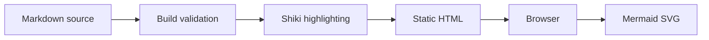
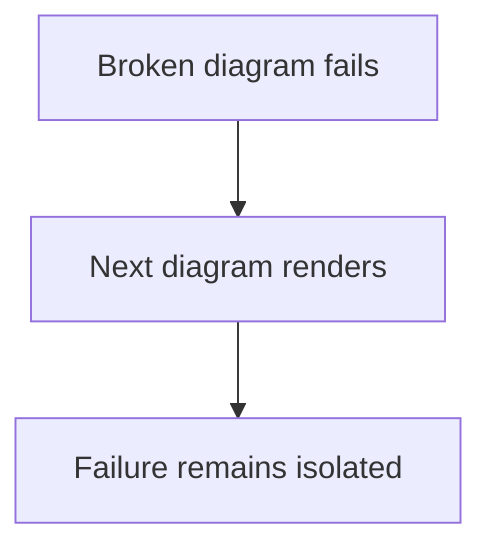
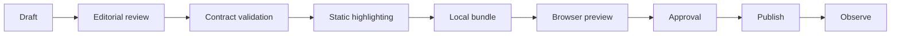

这是一篇用于验收 Markdown 渲染链路的测试文章。页面应在 JavaScript 执行前就包含代码高亮；Mermaid 源码则先保持可读，浏览器渲染成功后再替换为 SVG。

## Inline code

普通 inline code 保持原样，例如 `content/posts/` 和 `npm run build`。显式标注语言的 inline code 应移除标记并显示语法颜色，例如 `{ts} const ready: boolean = true`、`{python} result = values[:3]` 与 `{sql} SELECT id FROM posts`。

## Fenced code highlighting

### TypeScript

下面的代码块应使用 TypeScript grammar，并保留泛型、字符串与注释的颜色差异。

```ts
interface RenderResult<T> {
  value: T
  renderedAt: Date
}

export function render<T>(value: T): RenderResult<T> {
  // Highlighted during the static build.
  return { value, renderedAt: new Date() }
}
```

### JSON

JSON 中的 key、字符串、数字和布尔值应有可辨识但低饱和度的配色。

```json
{
  "renderer": "shiki",
  "languages": 15,
  "buildTime": true
}
```

### HTML and CSS

HTML 必须被转义为文本，不能创建真正的 `<script>` 节点。

```html
<article data-state="ready">
  <script>alert("this must never execute")</script>
</article>
```

```css
.article-prose {
  max-width: 760px;
  color: var(--ink);
}
```

### Bash and Python aliases

这两个代码块分别使用 `shell` 与 `py` alias，最终应规范化为 Bash 与 Python。

```shell
npm install
npm test
```

```py
def visible(items):
    return [item for item in items if item.is_visible]
```

### Plain text

以下内容必须保留普通 `<pre><code>`，不应出现 Shiki token span。

```text
queued -> running -> completed
queued -> running -> failed
```

## Mermaid success path

图表初始状态显示下面的源码。Mermaid 成功后，源码隐藏并出现带有无障碍标题的 SVG。



## Mermaid failure isolation

下一张图故意包含更深层的 Mermaid 语法错误。构建应该成功；浏览器应显示固定错误提示并保留源码。它不能阻止后面的有效图表渲染。

```mermaid
flowchart TD
  accTitle: 故意损坏的流程图用于验证源码回退
  Broken[ --> Fallback
```



## Wide Mermaid diagram

在窄屏中，下面的 SVG 应只在图表容器内部横向滚动，页面本身不能变宽。



## Acceptance checklist

- 代码颜色在查看页面源码时已经存在；
- inline language marker 不出现在可见文本中；
- plain text fence 不带 Shiki wrapper；
- 第一张 Mermaid 图渲染为 SVG，并带有 `accTitle`；
- 损坏的 Mermaid 图显示错误和源码；
- 损坏图之后的图仍能渲染；
- 375px 视口下，宽图容器可横向滚动且 document 不溢出。
