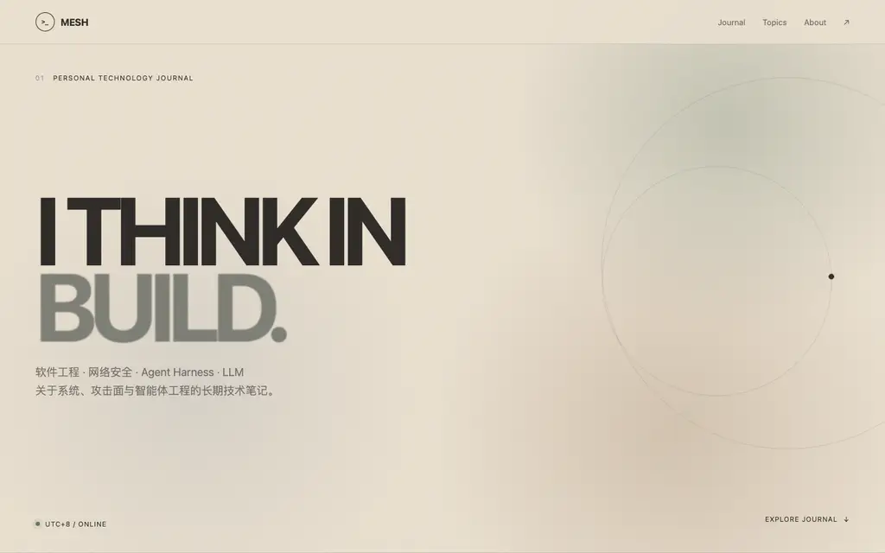
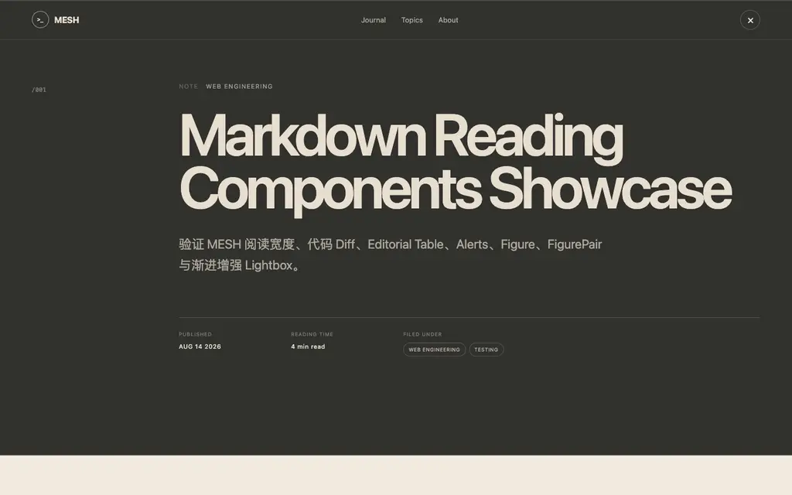
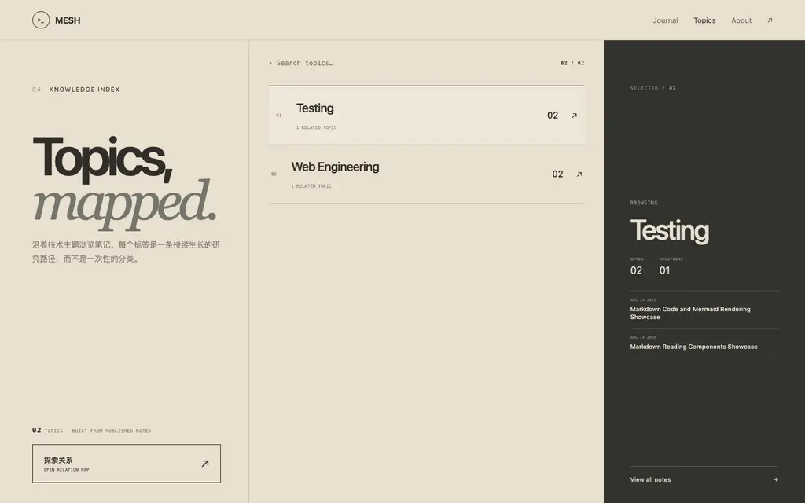
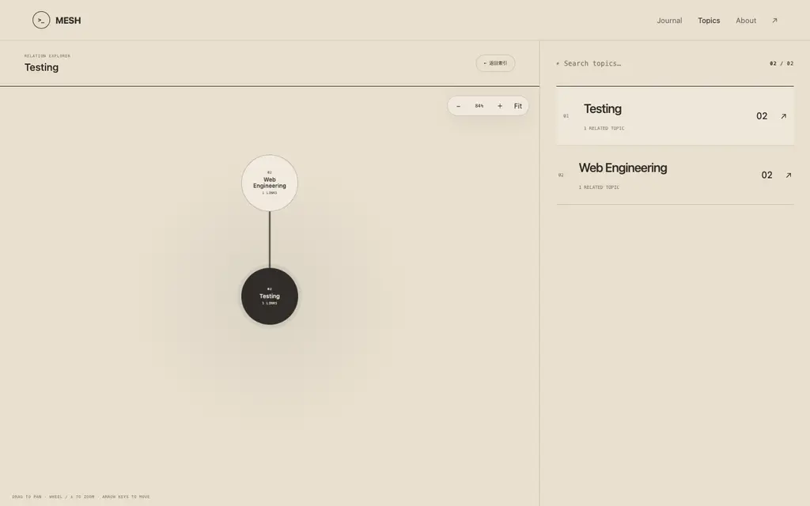

# 效果展示

MESH 是面向长篇技术内容的静态博客：低饱和 Morandi 配色、时间线首页、主题索引和强调阅读宽度的文章页面。

## 首页



首页提供：

- 动态欢迎标题与低动态偏好降级；
- 按发布时间排列的文章时间线；
- sticky 搜索和标签过滤；
- 可分享的 `?q=` 与 `?tag=` 查询状态；
- JavaScript 不可用时仍可阅读的静态文章卡片；
- 手机端单列布局。

## 文章页



文章页面包含：

- 阅读进度、文章编号、发布日期、阅读时间和标签；
- 自动生成的目录与上一篇/下一篇导航；
- Shiki 构建期代码高亮、diff 行和复制按钮；
- GFM 表格、五类 Alerts、普通引用和署名；
- `normal`、`wide`、`full` 三种 Figure 布局；
- FigurePair、Columns 和渐进增强 Lightbox；
- 本地按需加载的 Mermaid 渲染；
- Paper / Ink 阅读主题契约；
- reduced-motion 与 reduced-transparency 无障碍降级。

## Topics



`/tags/` 根据已发布文章的标签共现关系生成主题索引。草稿不会贡献主题节点、文章数量或关系边。

Topics 页面提供：

- 按文章数量排列的主题清单；
- 当前主题的文章数量和关联主题数量；
- 最近文章与关联主题浏览；
- 返回首页标签过滤结果的入口；
- 通过 `?tag=` 保存和分享当前主题；
- JavaScript 不可用时仍然完整可读的静态默认主题。

### 关系探索



点击“探索关系”会切换到标签关系图。节点代表已发布文章中的标签，连线来自标签在同一篇文章中的共现。可以选择节点切换当前主题，使用缩小、放大和 Fit 控件调整视图，并通过同时包含 `?tag=` 与 `view=relations` 的 URL 分享当前探索状态。

## 本地查看完整效果

构建并启动静态预览：

```bash
npm install
npm run build
npm run preview
```

打开以下页面：

- 首页：<http://127.0.0.1:4173/>
- Topics：<http://127.0.0.1:4173/tags/>
- 自有文章：`http://127.0.0.1:4173/articles/<slug>/`

将 `<slug>` 替换为 `content/posts/` 中自有 Markdown 的文件名（不含 `.md`）。Markdown 组件能力由测试夹具验证，不要求在博客中发布示例文章。

不安装依赖时，也可以直接打开 [`examples/mesh-demo.html`](../examples/mesh-demo.html) 查看独立的单文件首页演示。该文件用于快速体验，不代替 `dist/` 中的完整构建。