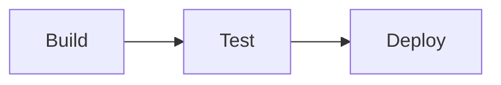

# 编写博客文章

MESH 从 `content/posts/` 读取 Markdown，构建时校验元数据和扩展语法，再生成静态 HTML。仓库不会要求保留或发布测试文章；Markdown 展示能力由独立的 [`tests/fixtures/markdown-showcase.md`](../tests/fixtures/markdown-showcase.md) 夹具验证。

## 新建文章

文件名必须是小写 kebab-case；它同时是文章 URL 的 slug。例如：

```text
content/posts/building-reliable-agents.md
→ /articles/building-reliable-agents/
```

每篇文章必须以 YAML front matter 开始：

```md
---
title: Building Reliable Agents
description: 一句话概括文章内容，同时用于首页摘要和 SEO 元数据。
publishedAt: "2026-08-15T12:00:00+08:00"
tags:
  - Software Engineering
  - LLM
---

正文从这里开始。
```

约束：

- `title`、`description`、`publishedAt` 必须是非空字符串。
- `tags` 必须是非空字符串数组；第一个标签会作为文章主标签展示。
- `publishedAt` 只接受 `YYYY-MM-DDTHH:mm:ssZ` 或 `YYYY-MM-DDTHH:mm:ss±HH:MM`，必须显式包含时区。
- 每篇已发布文章的 `publishedAt` 必须代表不同的时间点。
- 文章按发布时间从新到旧展示；编号从最旧文章的 `001` 开始，因此调整发布时间可能改变编号。
- 添加 `draft: true` 可让文章退出页面、索引、RSS、标签图谱和编号。
- 原始 HTML 会被转义，不可用来绕过 Markdown 渲染规则。

## 标题与目录

文章标题来自 front matter 的 `title`，模板会将它渲染为页面顶部的 `h1`，但不会加入文章目录。正文可使用 `#` 至 `######`，对应 `h1` 至 `h6`；每个正文标题都会生成稳定锚点，并按文档顺序进入目录。HTML 与 Markdown 仅定义到 `h6`，不存在 `h7`。Columns 内部的 `title` 会渲染为局部 `h3`，但不会进入目录。
```markdown
---
title: "文章标题"
---
# 正文一级章节
## 正文二级章节
```

## 代码

### 代码块

支持以下不区分大小写的语言名称和别名：

| 语言 | 标识 |
| :--- | :--- |
| JavaScript | `javascript`, `js` |
| JSX | `jsx` |
| TypeScript | `typescript`, `ts` |
| TSX | `tsx` |
| JSON | `json` |
| HTML | `html` |
| CSS | `css` |
| Bash | `bash`, `sh`, `shell` |
| YAML | `yaml`, `yml` |
| Markdown | `markdown`, `md` |
| Python | `python`, `py` |
| Go | `go` |
| Rust | `rust`, `rs` |
| SQL | `sql` |
| Dockerfile | `dockerfile` |

空标识或 `text`、`txt`、`plain`、`plaintext` 会生成无高亮的纯文本块。未知语言会使构建失败。

Shiki diff 标记必须放在高亮代码行末尾；标记不会出现在页面和复制结果中：

````md
```js
console.log('old') // [!code --]
console.log('new') // [!code ++]
```
````

### Inline code

普通 inline code 写作 `` `responses.create` ``。需要语法高亮时使用 `` `{ts} const ready = true` ``。不支持的语言和格式错误的注解会使构建失败。

## 表格、提醒与引用

GFM 表格保留 `<table>` 语义。窄屏下，宽表只在自己的容器内横向滚动。完全由数字和受支持单位组成的单元格会自动右对齐；显式 GFM 对齐优先。

GitHub Alert 语法支持五种大写类型：`NOTE`、`TIP`、`IMPORTANT`、`WARNING`、`CAUTION`。

```md
> [!NOTE]
> 补充说明。
>
> - Alert 内仍可使用普通 Markdown。
```

其他 blockquote 保持普通引用样式。最后一个独立段落以破折号和空格 `— ` 开头时，会作为署名：

```md
> Systems should expose failure domains explicitly.
>
> — Engineering Notes
```

## 容器语法

公开容器都使用 `:::` fence。属性必须放在 `{}` 中，名称严格匹配，值使用双引号。缺失、重复、未知或格式错误的属性都会使构建失败。

### Figure

Figure 必须提供 `src`、`alt`、`caption`、`layout`、`width` 和 `height`。

```md
::: figure {src="/images/runtime.webp" alt="Runtime architecture" caption="Runtime Architecture" layout="wide" width="1600" height="900" srcset="/images/runtime-800.webp 800w, /images/runtime.webp 1600w" sizes="(max-width: 640px) 100vw, 64rem"}
:::
```

- `layout`：`normal`、`wide` 或 `full`。
- `width`、`height`：正整数，用于预留布局空间。
- `src`：相对路径、根路径、HTTP 或 HTTPS URL。
- 可选 `srcset`、`sizes` 和 `loading="lazy|eager"`；`loading` 默认为 `lazy`。
- 图片和 caption 会生成完整静态 HTML；Lightbox 只是渐进增强。

### FigurePair

FigurePair 必须直接包含两个空的 Figure 子容器。父容器需要 `caption`；每个子 Figure 需要 `src`、`alt`、`label`、`width` 和 `height`。

```md
::: figure-pair {caption="Runtime migration"}
::: figure {src="/images/before.webp" alt="Shared workspace" label="Before" width="1200" height="800"}
:::
::: figure {src="/images/after.webp" alt="Isolated workspace" label="After" width="1200" height="800"}
:::
:::
```

独立 Figure 和 FigurePair 共用文章内的 `FIGURE 01`、`FIGURE 02` 序列；一个 FigurePair 只占一个编号。

### Columns

Columns 必须直接包含两个 Column，不接受属性，也不能嵌套。每个 Column 必须提供 `title`，正文可包含完整块级 Markdown。

```md
::: columns
::: column {title="Before"}
- Shared state
- Implicit merge
:::

::: column {title="After"}
- Artifact edges
- Integration task
:::
:::
```

Column 不能脱离 Columns 使用；Columns 内也不能出现两个 Column 以外的直接子块。

## Paper / Ink 主题

阅读组件从最近的主题宿主继承设计 token。省略 `data-theme` 或设置 `data-theme="paper"` 使用 Paper；在 `<html>` 或包裹完整阅读区域的祖先上设置 `data-theme="ink"` 使用 Ink。公开主题只接受这两个值，Markdown 容器没有 `theme` 属性，也不应直接覆盖组件内部的状态颜色。

## Mermaid

使用标识为 `mermaid` 的 fenced code。第一条有效指令必须是小写 `flowchart` 或 `graph`，并且必须恰好包含一条非空 `accTitle:`：

````md

````

Mermaid front matter 和初始化指令会被拒绝。构建产物先保留可读源码，浏览器再按严格安全模式加载本地 Mermaid chunk；渲染失败时源码仍然可读。

## 图片与静态资源

将站点资源放入 `public/`。构建时，其内容会复制到 `dist/` 根目录。例如 `public/images/runtime.webp` 在文章中使用 `/images/runtime.webp`。

当前页面和资源链接都是根路径，因此站点必须部署在域名根路径。详见[部署 MESH](deployment.md)。

## 发布前检查

```bash
SITE_URL=https://blog.example.com npm run build
npm test
npm run preview
```

本地访问 `http://127.0.0.1:4173/`，至少检查首页、文章页、`/tags/`、移动端宽度、代码复制、Mermaid 和 Lightbox。