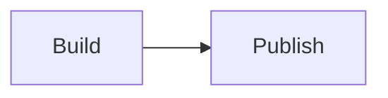

## 标题级别

### 二级章节

## ⚙️ 符号标题

## C++ & Rust → 实战

## 50% → 100% 迁移

## 🚀 Emoji 标题

### 🧩 组件化

### 💉 Demo

## 相同章节

## 相同章节

## 相同章节

#### 四级标题

##### 五级标题

###### 六级标题

```c
int main(void) { return 0; }
```

```cpp
int main() { return 0; }
```

```go
package main
func main() {}
```

```php
<?php echo 'mesh';
```

```python
print('mesh')
```

```rust
fn main() {}
```

```text
plain output
```



::: figure {src="/images/runtime-architecture.svg" alt="Runtime architecture" caption="Runtime Architecture" layout="normal" width="1600" height="900"}
:::

::: figure-pair {caption="Runtime migration"}
::: figure {src="/images/runtime-architecture.svg" alt="Runtime architecture before migration" label="Before" width="1600" height="900"}
:::

::: figure {src="/images/runtime-architecture.svg" alt="Runtime architecture after migration" label="After" width="1600" height="900"}
:::
:::

::: columns
::: column {title="Before"}
Shared workspace.
:::

::: column {title="After"}
Isolated workspace.
:::
:::
